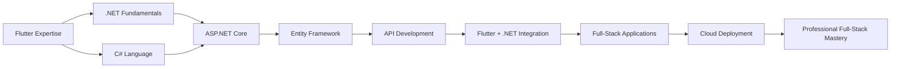

<h1 align="center">👋 Hello World! I'm Shushil Gautam</h1>
<h3 align="center">Flutter Expert | .NET Learner | Full-Stack Aspirant</h3>

  
  
  

  

---

## 🚀 About Me

I'm a **Computer Science student** passionate about crafting seamless **mobile & web experiences**.

- 🔭 **Currently Building**: Enterprise apps with **Flutter** frontend & **.NET** backend  
- 🌱 **Learning**: .NET Core, ASP.NET MVC, Bootstrap 5, and Entity Framework  
- 🛠️ **Expertise**: Flutter (Dart), Android (Java/Kotlin), UI/UX Design  
- ✍️ Tech writer at [CodeKaizer Blog](https://codekaizer.blogspot.com/)  
- 💡 Focused on **clean architecture & performance optimization**  
- ⚡ **Fun Fact:** I can recognize anime from a single screenshot frame!

---

## 🛠️ Tech Stack

### 🌐 Full-Stack Development

### 📱 Mobile Development

### 🧰 Tools & Platforms

## 📊 GitHub Stats

---

## 🚧 Current Learning Path

## 🤝 Connect With Me

     

----------

 <i>"Building bridges between ideas and implementation, one commit at a time."</i> 🌉💻 
 
  
 
